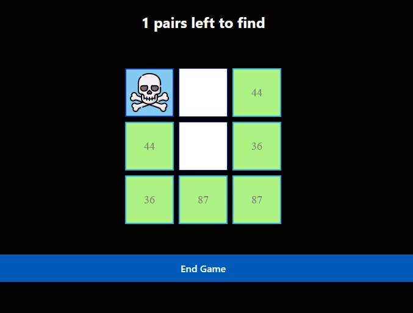

# Memory-guessing Game

A cross-platform memory matching game built with React Native and Expo. Players flip cards to find matching number pairs. One item is a non-valid number. A player receives a number of tries it took them to complete the game, the goal is to complete it in the least number of tries.

## Stack

- **Frontend:** React Native, Expo, Expo Router (file-based routing)
- **Backend:** Node.js, Express
- **Language:** TypeScript
- **Styling:** React Native StyleSheet, custom theme hooks
- **Platforms:** Web, iOS, Android
- **Tools:** ESLint

## Architecture

The project uses a **component-driven architecture** with file-based routing:

- **Expo Router** — File-based routing in `app/` directory
- **GameBoard Component** — Core game logic managing state, card flipping, and pair matching
- **Custom Hooks** — `useThemeColor` and `useColorScheme` for consistent theming
- **Express Server** — Serves the production web build from `/dist`
- **Constants** — Centralized color configuration for maintainability

**Game Flow:**
1. Board initializes with shuffled number pairs
2. Player taps cards to reveal numbers
3. Matching pairs remain visible; mismatches flip back
4. Game tracks attempts and remaining pairs

## Run

1. Install dependencies.
```
npm install
```

2. Start server - web mode

```
npm start
```

Alternatively: `npm run web` (web only), `npm run ios`, or `npm run android`

## Image

